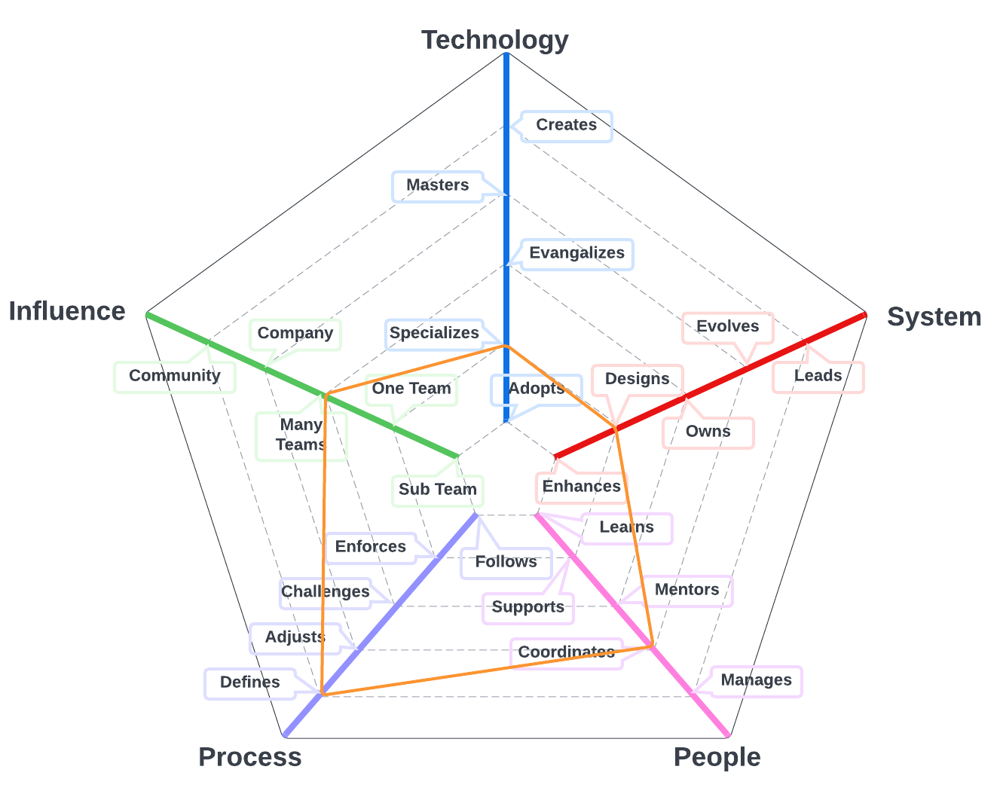
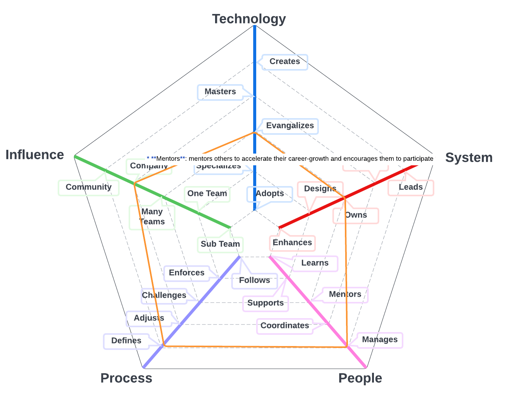
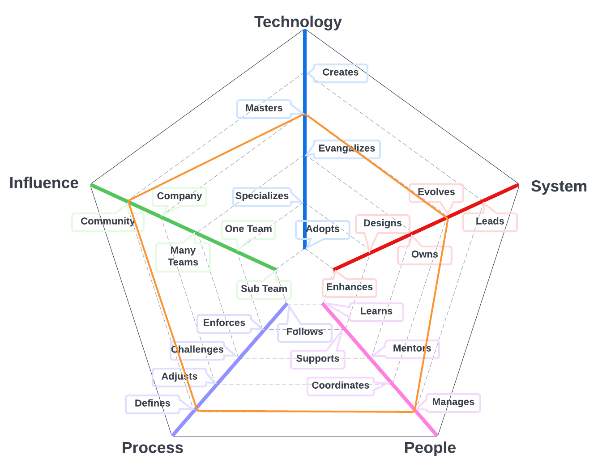

# Delivery Director

The primary system for team members on this path is the work discipline program that and includes models that can help the team manage their work, monitor their progress, and identify opportunties to streamline processes. 

| Level | Position |
| :---: | :---: |
| 1 | [DD1 - Delivery Director 1](#dd1---delivery-director-1) |
| 2 | [DD2 - Delivery Director 2](#dd2---delivery-director-2) |
| 3 | [DD3 - Delivery Director 3](#dd3---delivery-director-3) |

# System Specifics:
* **Technology**: Issue Management platforms, Agile development, Kanban, performance modeling (e.g., control charts, throughput) 
* **System**: work discipline and management
* **People**: relationship with the team(s)
* **Process**: level of engagement with product engineering processes
* **Influence**: social network influence

## DD1 - Delivery Director 1

* **Specializes**: is the go-to person for one or more products and takes initiative to learn new ones
* **Designs**: designs and implements medium to large size features while reducing the system's tech debt
* **Coordinates**: coordinates team members providing effective feedback and moderating discussions
* **Defines**: defines the right processes for the team's maturity level, balancing agility and discipline
* **Multiple Teams**: makes an impact not only on the whole team but also on other teams

## DD2 - Delivery Director 2

* **Specializes**: is the go-to person for one or more technologies and takes initiative to learn new ones
* **Owns**: owns the strategic direction of the system and is aware of its SLAs and operational constraints
* **Manages**: manages the career, expectations, performance with and eye towards job satisfaction and productivity
* **Defines**: defines the right processes for the team's maturity level, balancing agility and discipline
* **Company**: makes an impact on the whole tech organization

## DD3 - Delivery Director 3

* **Specializes**: is the go-to person for one or more technologies and takes initiative to learn new ones
* **Evolves**: evolves the architecture to support future requirements and defines its SLAs
* **Manages**: manages the team members' career, expectations, performance and level of happiness
* **Defines**: defines the right processes for the team's maturity level, balancing agility and discipline
* **Community**: makes an impact on the tech community

# Also Known As
* Program Manager
* PMO Lead**
* Chief of Staff

# Other Pages
* [**Introduction**](README.md)
* [**Software Engineer**](Software-Engineer.md)
* [**Software Director**](Software-Director.md) 
* [**Quality Engineer**](Quality-Engineer.md)
* [**Quality Director**](Quality-Director.md)
* [**Delivery Engineer**](Delivery-Engineer.md)
* [**Delivery Director**](Delivery-Director.md)
* [**Engineering Director**](Engineering-Director.md)
* [**Software Directror vs Engineering Support**](Comparison-Software-Director-Engineering-Director.md)
* [**Directing Directrors**](Directing-Directors.md)
