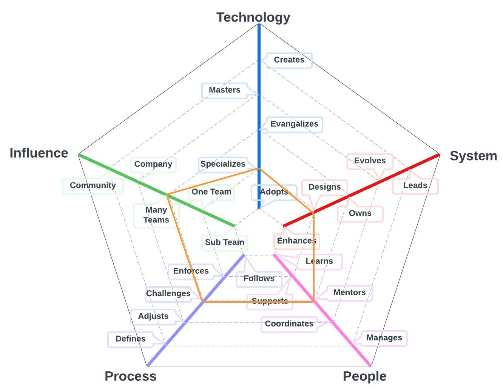

# Delivery Engineer

The primary system for team members on this path is the work discipline program that and includes models that can help the team manage their work, monitor their progress, and identify opportunities to streamline processes. 

| Level | Position |
| :---: | :---: |
| 1 | [DE1 - Delivery Engineer 1](#de1---delivery-engineer-1) |
| 2 | [DE2 - Delivery Engineer 2](#de2---delivery-engineer-2) |
| 3 | [DE3 - Delivery Engineer 3](#de3---delivery-engineer-3) |
| 4 | [DE4 - Delivery Engineer 4](#de3---delivery-engineer-4) |

# System Specifics:
* **Technology**: Issue Management platforms, Agile development, Kanban, performance modeling (e.g., control charts, throughput) 
* **System**: work discipline and management
* **People**: relationship with the team(s)
* **Process**: level of engagement with product engineering processes
* **Influence**: social network influence

## DE1 - Delivery Engineer 1

* **[Technology](README.md#technology) - Adopts**
* **[System](README.md#technology) - Enhances**
* **[People](README.md#people) - Learns**
* **[Process](README.md#process) - Follows**
* **[Influence](README.md#influence) - Sub Team**

## DE2 - Delivery Engineer 2

* **[Technology](README.md#technology) - Adopts**
* **[System](README.md#technology) - Designs**
* **[People](README.md#people) - Supports**
* **[Process](README.md#process) - Enforces**
* **[Influence](README.md#influence) - Team**

## DE3 - Delivery Engineer 3

* **[Technology](README.md#technology) - Specializes**
* **[System](README.md#technology) - Designs**
* **[People](README.md#people) - Mentors**
* **[Process](README.md#process) - Challenges**
* **[Influence](README.md#influence) - Many Teams**

## DE4 - Delivery Engineer 4

* **[Technology](README.md#technology) - Specializes**
* **[System](README.md#technology) - Designs**
* **[People](README.md#people) - Coordinates**
* **[Process](README.md#process) - Adjusts**
* **[Influence](README.md#influence) - Many Teams**

# Also Known As
* Project Manager
* Project Administrator
* PM

# Other Pages
* [**Introduction**](README.md)
* [**Software Engineer**](Software-Engineer.md)
* [**Software Director**](Software-Director.md) 
* [**Quality Engineer**](Quality-Engineer.md)
* [**Quality Director**](Quality-Director.md)
* [**Delivery Engineer**](Delivery-Engineer.md)
* [**Delivery Director**](Delivery-Director.md)
* [**Product Engineer**](Product-Engineer.md)
* [**Product Director**](Product-Director.md)
* [**Engineering Director**](Engineering-Director.md)
* [**Software Director vs Engineering Support**](Comparison-Software-Director-Engineering-Director.md)
* [**Directing Directors**](Directing-Directors.md)__
