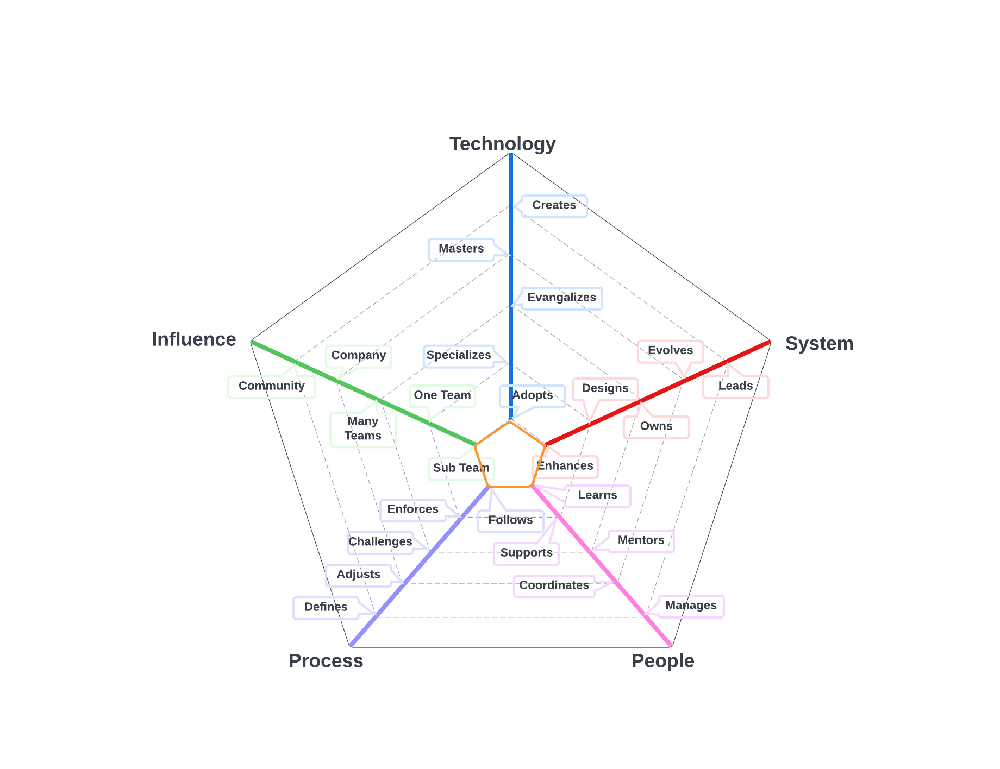
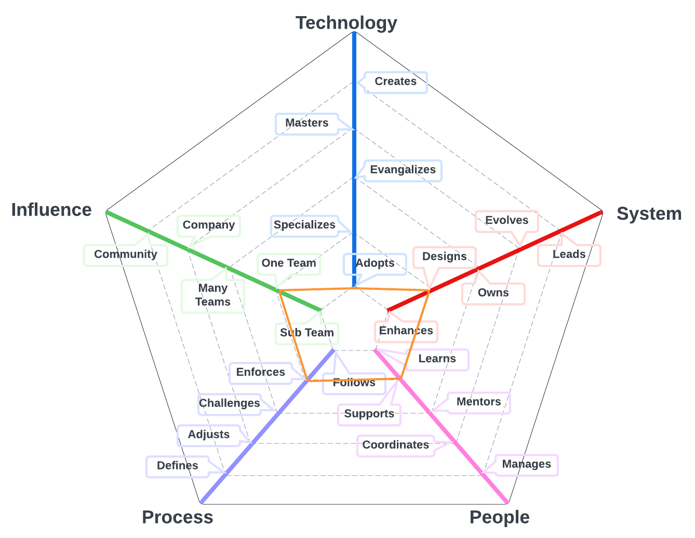
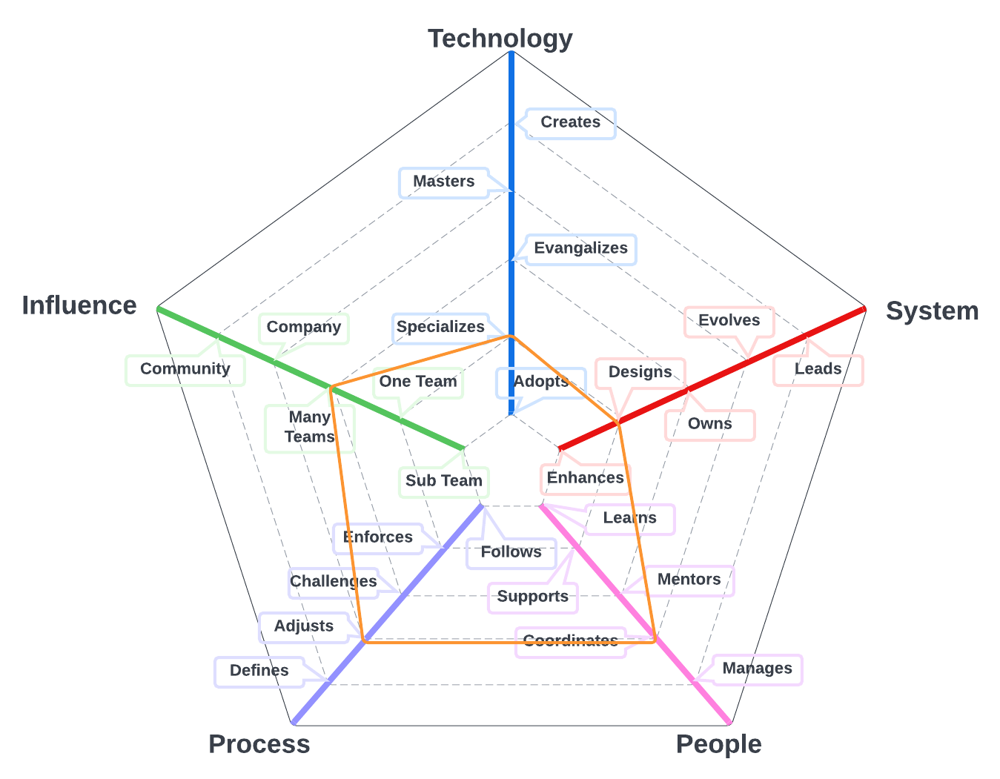

# Delivery Engineer

The primary system for team members on this path is the work discipline program that and includes models that can help the team manage their work, monitor their progress, and identify opportunities to streamline processes. 

| Level | Position |
| :---: | :---: |
| 1 | [DE1 - Delivery Engineer 1](#de1---delivery-engineer-1) |
| 2 | [DE2 - Delivery Engineer 2](#de2---delivery-engineer-2) |
| 3 | [DE3 - Delivery Engineer 3](#de3---delivery-engineer-3) |
| 4 | [DE4 - Delivery Engineer 4](#de3---delivery-engineer-4) |

# System Specifics:
* **Technology**: Issue Management platforms, Agile development, Kanban, performance modeling (e.g., control charts, throughput) 
* **System**: work discipline and management
* **People**: relationship with the team(s)
* **Process**: level of engagement with product engineering processes
* **Influence**: social network influence

## DE1 - Delivery Engineer 1

* **Adopts**: actively learns and adopts the project management methodologies and tools defined by the team
* **Enhances**: updates and enhances project plans for single components of the platform
* **Learns**: quickly learns from others and consistently steps up when it is required
* **Follows**: follows the team processes, collecting data to help the team deliver as efficiently as possible
* **Subsystem**: makes an impact on one or more product / platform subsystems

## DE2 - Delivery Engineer 2

* **Adopts**: actively learns and adopts the project management methodologies and tools defined by the team
* **Designs**: designs project plans for new initiatives and sets up processes to successfully manage the project
* **Supports**: proactively supports other team members and helps them to be successful
* **Enforces**: enforces the team processes and data collection, making sure everybody understands the benefits and trade-offs
* **One Team**: makes an impact on one or more product / platform subsystems

## DE3 - Delivery Engineer 3

* **Specializes**: is the go-to person for the requirements of one or more product / platform features  
* **Designs**: designs project plans for new initiatives and sets up processes to successfully manage the project
* **Mentors**: mentors others to accelerate their career-growth and encourages them to participate
* **Challenges**: challenges the team processes, looking for ways to improve them
* **Many Teams**: makes an impact on the whole team, not just on specific parts of it

## DE4 - Delivery Engineer 4

* **Specializes**: is the go-to person for multiple projects and takes initiative to support new ones
* **Designs**: designs project plans for new initiatives and sets up processes to successfully manage the project
* **Coordinates**: coordinates with Delivery Managers to provide drive the effective delivery of multiple projects
* **Adjusts**: adjusts the team processes, listening to feedback and guiding the team through the changes
* **Many Teams**: makes an impact on multiple teams

# Also Known As
* Project Manager
* Project Administrator
* PM

# Other Pages
* [**Introduction**](README.md)
* [**Software Engineer**](Software-Engineer.md)
* [**Software Director**](Software-Director.md) 
* [**Quality Engineer**](Quality-Engineer.md)
* [**Quality Director**](Quality-Director.md)
* [**Delivery Engineer**](Delivery-Engineer.md)
* [**Delivery Director**](Delivery-Director.md)
* [**Engineering Director**](Engineering-Director.md)
* [**Software Director vs Engineering Support**](Comparison-Software-Director-Engineering-Director.md)
* [**Directing Directors**](Directing-Directors.md)