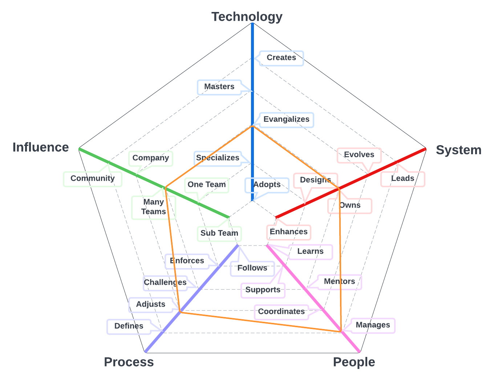
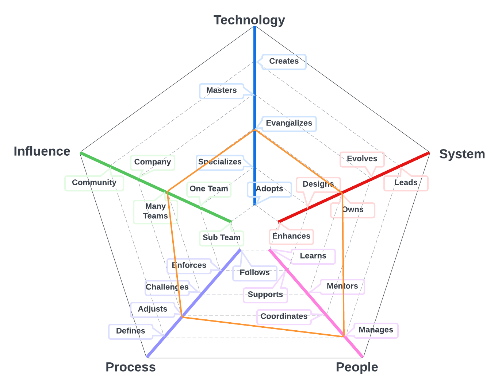
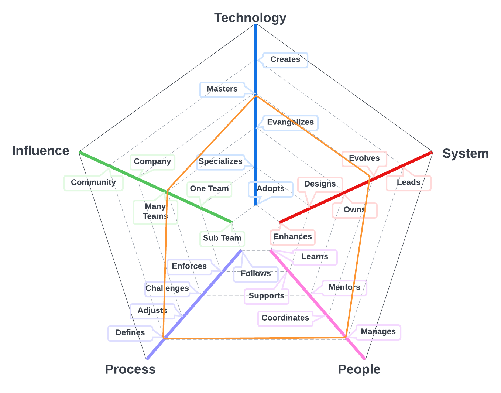

# Engineering Director

Accountable for the consistent delivery, career growth, and productivity for all directors and engineers.

| Level | Position |
| :---: | :---: |
| 1 | [ED1 - Engineering Director 1](#ed1---engineering-director-1) |
| 2 | [ED2 - Engineering Director 2](#ed2---engineering-director-2) |
| 3 | [ED3 - Engineering Director 3](#ed3---engineering-director-3) |

## ED1 - Engineering Director 1

* **Specializes**: is the go-to person for one or more technologies and takes initiative to learn new ones
* **Designs**: designs and implements medium to large size features while reducing the system's tech debt
* **Manages**: manages team member's career, expectations, performance with and eye towards job satisfaction and productivity and company alignment
* **Challenges**: challenges the team processes, looking for ways to improve them
* **One Team**: makes an impact on the whole team, not just on specific parts of it

## ED2 - Engineering Director 2

* **Evangelizes**: researches, creates proofs of concept and introduces new technologies to the team
* **Owns**: owns the production operation and monitoring of the system and is aware of its SLAs
* **Manages**: manages team member's career, expectations, performance with and eye towards job satisfaction and productivity and company alignment
* **Adjusts**: adjusts the team processes, listening to feedback and guiding the team through the changes
* **Many Teams**: makes an impact not only on the whole team but also on other teams

## ED3 - Engineering Director 3

* **Masters**: has very deep knowledge about the whole technology stack of the system
* **Evolves**: evolves the architecture to support future requirements and defines its SLAs
* **Manages**: manages team member's career, expectations, performance with and eye towards job satisfaction and productivity and company alignment
* **Defines**: defines the right processes for the team's maturity level, balancing agility and discipline
* **Many Teams**: makes an impact not only on the whole team but also on other teams

# Also Known As
* Engineering Director
* VP of Engineering

# Other Pages
* [**Introduction**](README.md)
* [**Software Engineer**](Software-Engineer.md)
* [**Software Director**](Software-Director.md) 
* [**Quality Engineer**](Quality-Engineer.md)
* [**Quality Director**](Quality-Director.md)
* [**Delivery Engineer**](Delivery-Engineer.md)
* [**Delivery Director**](Delivery-Director.md)
* [**Engineering Director**](Engineering-Director.md)
* [**Software Directror vs Engineering Support**](Comparison-Software-Director-Engineering-Director.md)
* [**Directing Directrors**](Directing-Directors.md)
