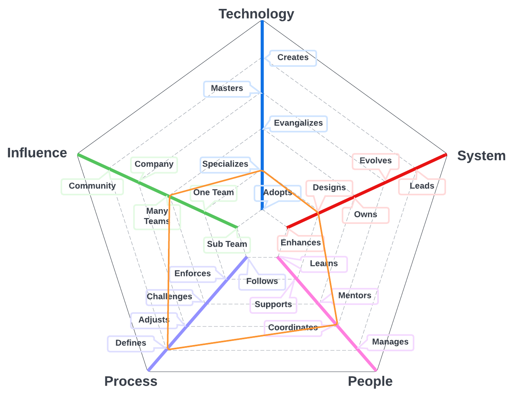
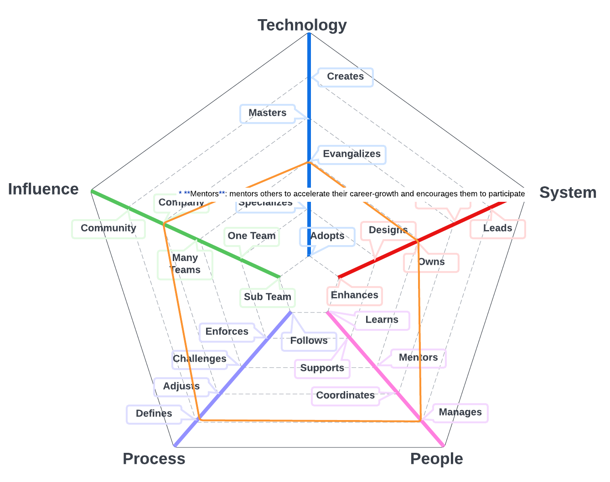

# Product Director

Role responsible for defining the strategic direction for products. They work with users, stakeholders, industry experts, market researchers, and perform research in order to define the best path forward for our products.

| Level | Senior | Position |
| :---: | :---: | :---: |
| 1 | Yes | [PD1 - Product Director 1](#tpm1---product-director-1) |
| 2 | Yes | [PD2 - Product Director 2](#tpm2---product-director-2) |
| 3 | Yes | [PD3 - Product Director 3](#tpm3---product-director-3) |

# System Specifics:
* **Technology**: Issue Management platforms,  
* **System**: product engineering program
* **People**: relationship with the team(s)
* **Process**: level of engagement with product engineering process
* **Influence**: social network influence

## PD1 - Product Director 1

* **Specializes**: is the go-to person for one or more technologies used in the system and takes initiative to learn new ones
* **Designs**: designs and implements medium to large size features while reducing the system's tech debt
* **Coordinates**: coordinates team members providing effective feedback and moderating discussions
* **Defines**: defines the right processes for the team's system, maturity level, balancing agility and discipline
* **Multiple Teams**: makes an impact not only his/her team but also on other teams

## PD2 - Product Director 2

* **Specializes**: is the go-to person for one or more technologies used in the system and takes initiative to learn new ones
* **Owns**: owns the production operation and monitoring of the system and is aware of its SLAs
* **Manages**: manages the team members' career, expectations, performance, productivity, and job satisfaction
* **Defines**: defines the right processes for the team's system, maturity level, balancing agility and discipline
* **Company**: makes an impact on the whole tech organization

## PD3 - Product Director 3

* **Specializes**: is the go-to person for one or more technologies used in the system and takes initiative to learn new ones
* **Evolves**: evolves the system to support future requirements and defines its SLAs
* **Manages**: manages the team members' career, expectations, performance, productivity, and job satisfaction
* **Defines**: defines the right processes for the team's system, maturity level, balancing agility and discipline
* **Community**: makes an impact on the tech community

# Other Pages
* [**Introduction**](README.md)
* [**Software Engineer**](Software-Engineer.md)
* [**Software Director**](Software-Director.md) 
* [**Quality Engineer**](Quality-Engineer.md)
* [**Quality Director**](Quality-Director.md)
* [**Delivery Engineer**](Delivery-Engineer.md)
* [**Delivery Director**](Delivery-Director.md)
* [**Product Engineer**](Product-Engineer.md)
* [**Product Director**](Product-Director.md)
* [**Engineering Director**](Engineering-Director.md)
* [**Software Director vs Engineering Support**](Comparison-Software-Director-Engineering-Director.md)
* [**Directing Directors**](Directing-Directors.md)