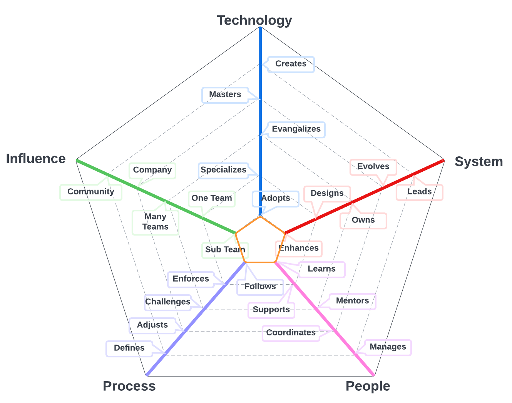
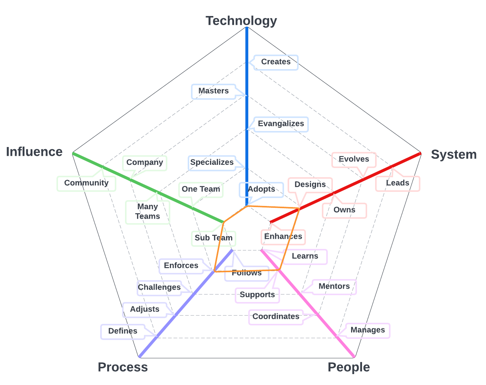
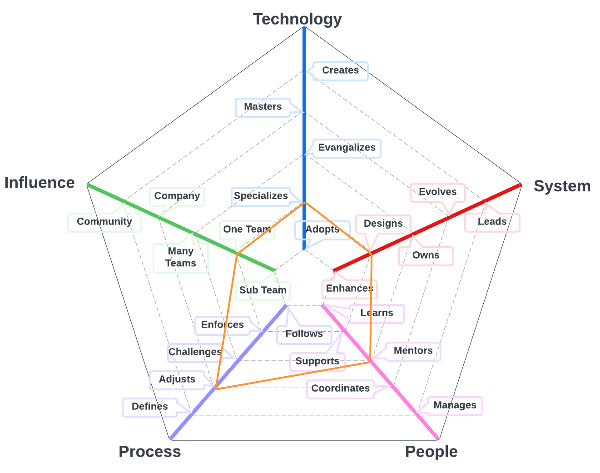
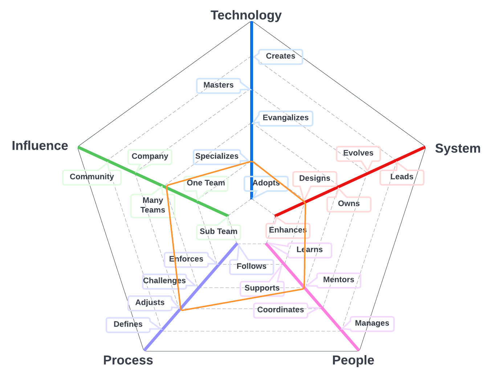

# Product Engineer

Role responsible for working with business leaders, industry experts, customers, and stakeholders to identify, document, and communicate requirements.

| Level | Senior | Position |
| :---: | :---: | :---: |
| 1 | No | [RE1 - Product Engineer 1](#pe1---product-engineer-1) |
| 2 | No | [RE2 - Product Engineer 2](#pe2---product-engineer-2) |
| 3 | No | [RE3 - Product Engineer 3](#pe3---product-engineer-3) |
| 4 | No | [RE4 - Product Engineer 4](#pe4---product-engineer-4) |

# System Specifics:
* **Technology**: issue management platforms
* **System**: product engineering program
* **People**: relationship with the team(s)
* **Process**: level of engagement with product engineering process
* **Influence**: social network influence

## PE1 - Product Engineer 1

* **Adopts**: actively learns and adopts the technology and tools defined by the team for the system
* **Enhances**: successfully pushes new features and bug fixes to improve and extend the system
* **Learns**: quickly learns from others and consistently steps up when it is required
* **Follows**: follows the team processes, delivering a consistent flow of requirements that result in production enhancements
* **Subsystem**: makes an impact on one or more product / platform subsystems

## PE2 - Product Engineer 2

* **Adopts**: actively learns and adopts the technology and tools defined by the team for the system
* **Designs**: specifies requirements for medium to large size enhancements or new capabilities 
* **Supports**: proactively supports other team members and helps them to be successful
* **Enforces**: enforces the team requirements engineering processes, making sure everybody understands the benefits and trade-offs
* **Subsystem**: makes an impact on one or more product / platform subsystems

## PE3 - Product Engineer 3

* **Specializes**: is the go-to person for one or more technologies and takes initiative to learn new ones
* **Designs**: defines and documents requirements for medium to large size enhancements or new capabilities
* **Mentors**: mentors others to accelerate their career-growth and encourages them to participate
* **Challenges**: challenges the team processes, looking for ways to improve them
* **Team**: makes an impact on the whole team, not just on specific parts of it

## PE4 - Product Engineer 4

* **Specializes**: is the go-to person for one or more technologies and takes initiative to learn new ones
* **Designs**: defines and documents requirements for medium to large size enhancements or new capabilities
* **Mentors**: mentors others to accelerate their career-growth and encourages them to participate
* **Adjusts**: adjusts the team processes, listening to feedback and guiding the team through the changes
* **Multiple Teams**: makes an impact not only on the whole team but also on other teams

# Other Pages
* [**Introduction**](README.md)
* [**Software Engineer**](Software-Engineer.md)
* [**Software Director**](Software-Director.md) 
* [**Quality Engineer**](Quality-Engineer.md)
* [**Quality Director**](Quality-Director.md)
* [**Delivery Engineer**](Delivery-Engineer.md)
* [**Delivery Director**](Delivery-Director.md)
* [**Engineering Director**](Engineering-Director.md)
* [**Software Director vs Engineering Support**](Comparison-Software-Director-Engineering-Director.md)
* [**Directing Directors**](Directing-Directors.md)
