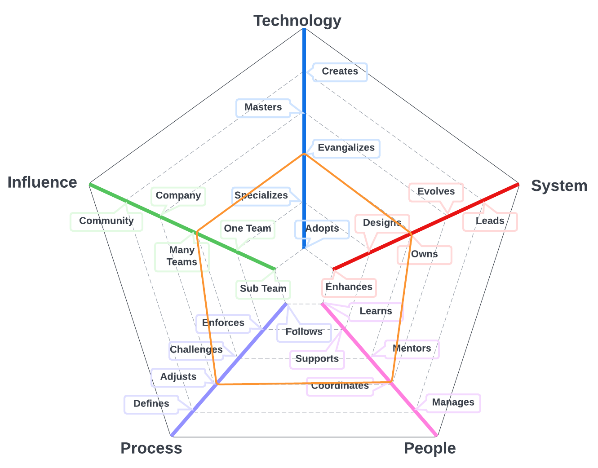
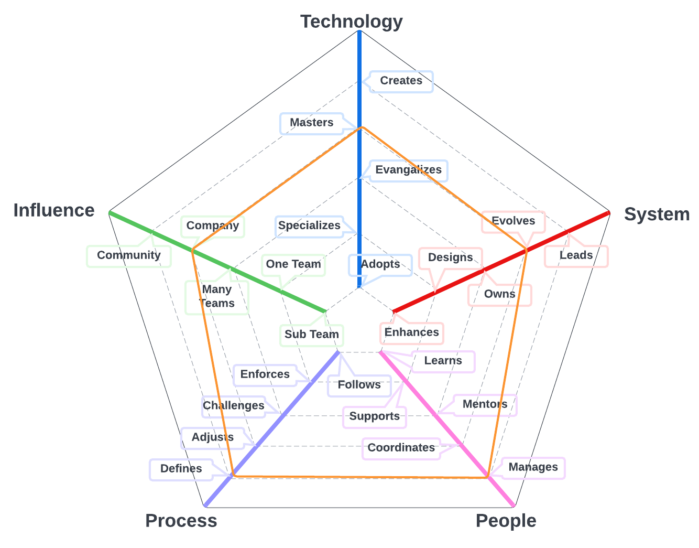
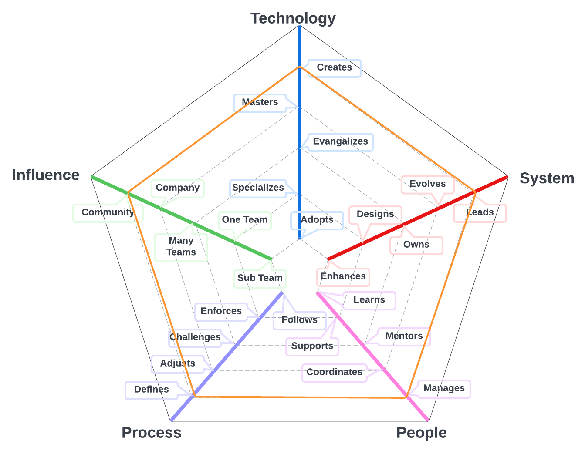

# Quality Director

The primary system for team members on this path is the quality program and includes automated regression tests for UI's and API's and related tools that we use to create a high qualituy experience for our customers. 

| Level | Position |
| :---: | :---: |
| 1 | [QD1 - Quality Director 1](#qd1---quality-director-1) |
| 2 | [QD2 - Quality Director 2](#qd2---quality-director-2) |
| 3 | [QD3 - Quality Director 3](#qd3---quality-director-3) |

# System Specifics:
* **Technology**: automated testing tools, code quality assessment tools 
* **System**: quality engineering program
* **People**: relationship with the team(s)
* **Process**: level of engagement with quality engineering processes
* **Influence**: social network influence

## QD1 - Quality Director 1

* **Evangelizes**: researches, creates proofs of concept and introduces new quality engineering technologies to the team
* **Owns**: owns the qualioty of production operations and monitoring of the system and is aware of its SLAs
* **Coordinates**: coordinates team members providing effective feedback and moderating discussions
* **Defines**: defines the right processes for the team's maturity level, balancing agility and discipline
* **Multiple Teams**: makes an impact not only on the whole team but also on other teams

## QD2 - Quality Director 2

* **Specializes**: is the go-to person for one or more technologies and takes initiative to learn new ones
* **Owns**: owns the strategic direction of the system and is aware of its SLAs and operational constraints
* **Manages**: manages the career, expectations, performance with and eye towards job satisfaction and productivity
* **Defines**: defines the right processes for the team's maturity level, balancing agility and discipline
* **Company**: makes an impact on the whole tech organization

## QD3 - Quality Director 3

* **Specializes**: is the go-to person for one or more technologies and takes initiative to learn new ones
* **Evolves**: evolves the architecture to support future requirements and defines its SLAs
* **Manages**: manages the team members' career, expectations, performance and level of happiness
* **Defines**: defines the right processes for the team's maturity level, balancing agility and discipline
* **Community**: makes an impact on the tech community

# Also Known As
* QA Lead
* Test Lead

# Other Pages
* [**Introduction**](README.md)
* [**Software Engineer**](Software-Engineer.md)
* [**Software Director**](Software-Director.md) 
* [**Quality Engineer**](Quality-Engineer.md)
* [**Quality Director**](Quality-Director.md)
* [**Delivery Engineer**](Delivery-Engineer.md)
* [**Delivery Director**](Delivery-Director.md)
* [**Delivery Engineer**](Delivery-Engineer.md)
* [**Delivery Director**](Delivery-Director.md)
* [**Engineering Director**](Engineering-Director.md)
* [**Software Directror vs Engineering Support**](Comparison-Software-Director-Engineering-Director.md)
* [**Directing Directrors**](Directing-Directors.md)
