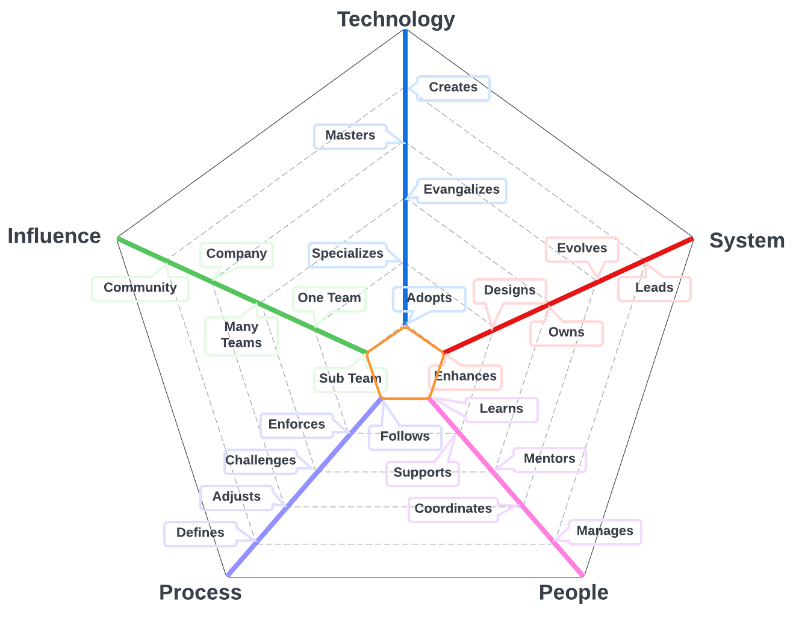
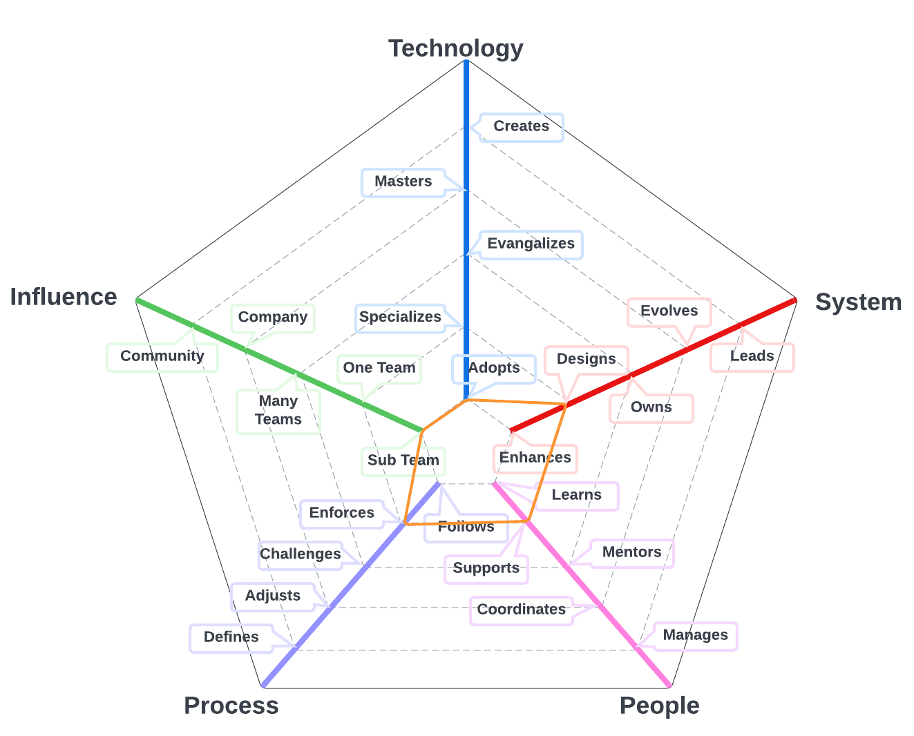
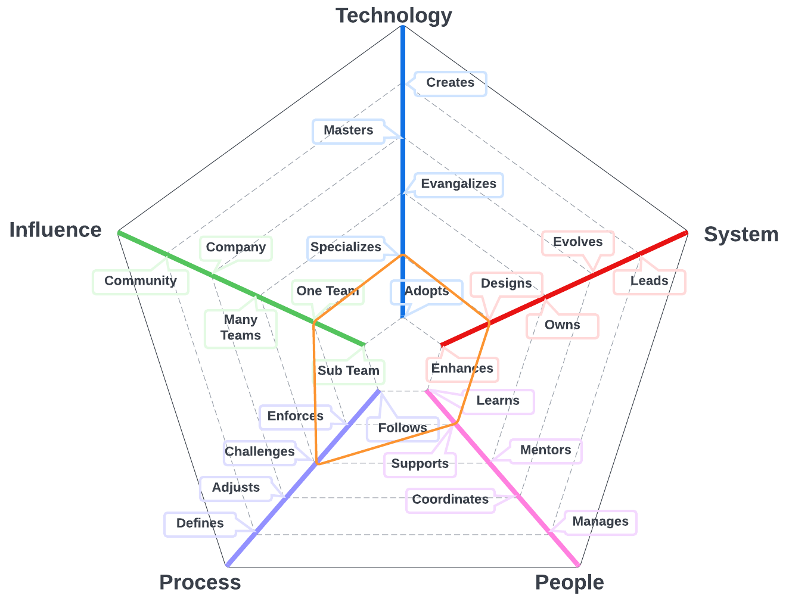
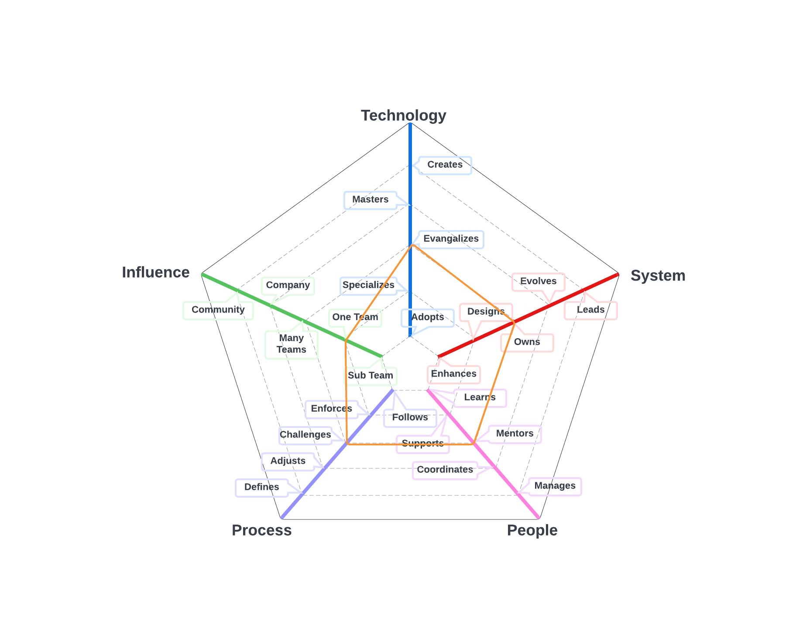

# Quality Engineer

The primary system for team members on this path is the quality program and includes automated regression tests for UI's and API's and related tools that we use to create a high quality experience for our customers. 

| Level | Senior | Position |
| :---: | :---: | :---: |
| 1 | No | [QE1 - Quality Engineer 1](#pe1---quality-engineer-1) |
| 2 | No | [QE2 - Quality Engineer 2](#pe2---quality-engineer-2) |
| 3 | No | [QE3 - Quality Engineer 3](#pe3---quality-engineer-3) |
| 4 | No | [QE4 - Quality Engineer 4](#pe4---quality-engineer-4) |

# System Specifics:
* **Technology**: automated testing tools, code quality assessment tools 
* **System**: quality engineering program
* **People**: relationship with the team(s)
* **Process**: level of engagement with quality engineering processes
* **Influence**: social network influence

## QE1 - Quality Engineer 1

* **Adopts**: actively learns and adopts the quality engineering technology and tools defined by the team
* **Enhances**: successfully pushes enhances existing tests for improvements and extensions to the system
* **Learns**: quickly learns from others and consistently steps up when it is required
* **Follows**: follows the team processes, delivering a consistent flow of features to production
* **Subsystem**: makes an impact on one or more subsystems

## QE2 - Quality Engineer 2

* **Adopts**: actively learns and adopts the quality engineering technology and tools defined by the team
* **Enhances**: successfully pushes enhances existing tests for improvements and extensions to the system
* **Learns**: quickly learns from others and consistently steps up when it is required
* **Follows**: follows the team processes, delivering a consistent flow of features to production
* **Subsystem**: makes an impact on one or more subsystems

## QE3 - Quality Engineer 3

* **Specializes**: is the go-to person for one or more technologies and takes initiative to learn new ones
* **Designs**: designs and implements tests for medium to large size features while maintaining existing tests
* **Supports**: proactively supports other team members and helps them to be successful
* **Challenges**: challenges the team processes, looking for ways to improve them
* **Team**: makes an impact on the whole team, not just on specific parts of it

## QE4 - Quality Engineer 4

* **Evangelizes**: researches, creates proofs of concept and introduces new quality engineering technologies to the team
* **Owns**: owns the production operation and monitoring of the system and is aware of its SLAs
* **Mentors**: mentors others to accelerate their career-growth and encourages them to participate
* **Challenges**: challenges the team processes, looking for ways to improve them
* **Team**: makes an impact on the whole team, not just on specific parts of it

# Also Known As
* Quality Assurance
* QA
* Tester

# Other Pages
* [**Introduction**](README.md)
* [**Software Engineer**](Software-Engineer.md)
* [**Software Director**](Software-Director.md) 
* [**Quality Engineer**](Quality-Engineer.md)
* [**Quality Director**](Quality-Director.md)
* [**Delivery Engineer**](Delivery-Engineer.md)
* [**Delivery Director**](Delivery-Director.md)
* [**Engineering Director**](Engineering-Director.md)
* [**Software Director vs Engineering Support**](Comparison-Software-Director-Engineering-Director.md)
* [**Directing Directors**](Directing-Directors.md)
