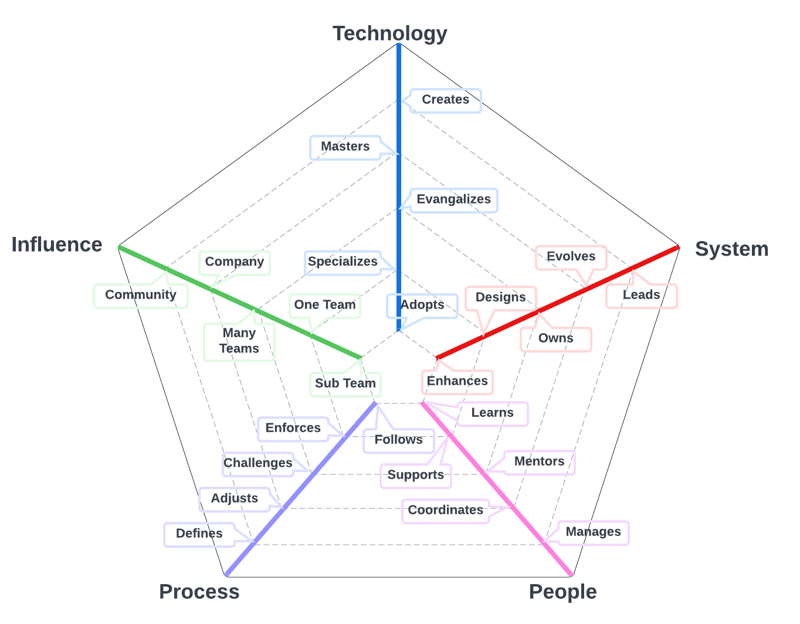

# Introduction

This framework allows managers and directors to have meaningful conversations with engineers about the expectations of each position and how to plan for the next step in their career path at Layr. It may be easy to conclude that the Layr Engineering Ladders represent a structural hierarchy. It is more beneficial to imagine an inverse triangle where the engineers who are workign together to producie software related things (code, tests, requirements, delivery models) are supported by directors who are primarily focused on leveling up the team.

Although the framework uses roles and levels that are somewhat standard in the US tech industry, every company is different. The roles described in this repository are specific to Layr and the needs of Layr end customers, internal users, and other stakeholders. Our mission is to create the very best technology enabled experience possible for our those that use our software.  We are also sensitive to helping you with your career and so provide a litle of synonyms for the roles we use so that you can help future employers understand how you controbuted to Layr.

We expect that the Layr Engineering Ladders will change over time as the landscape of software engineering changes.  We encourage all team members to submit pull requests to make the Layr Engineering Ladders better serve our customers with the very best experience possible. 

The framework relies heavily role level responsibilities for the different systems necessary to build great software for our customers.  To help you visualize the dimensions of these systems and the degree to which each level impacts that system, we rely heavily on radar charts:

We designed these charts to represent the progression in the scope of responsibilities, skills, and accountability's as they relate to the role responsible for the system.  As you explore each path ask yourself - how can I level up my skills to achieve the next step in the path to have a bigger impact on the system for which I'm responsible? How can I expand my impact on the system to be more valuable to our customers?  We've provided training and expected performance telemetry to help you and hope that you contribute to the conversation about what each rung means. 

# Career Paths

The framework has 5 different paths, each of which is critical to leveling up team members who can help Layr create the best technology enabled experience for our customers.  Each path is responsible for a system that can be the software we use to ernable our customers or a supporting system used to create that software. We break the first The first four paths have two segments - 

* Engineers - Engineers are generally responsible for building software related things for our customers, be it application software, infrastructure software, automated tests, user experiences, requirements, or project plans. They may mentor colleagues but do not have management or coordination responsibilities.
* Directors - Directors are generally responsible for building people related thing meant to grow and support engineers. Examples include ensuring that engineers have what they need to quickly build high quality software in a team they love, for a mission in which they believe, and have career plans to help them continuously upgrade their skills. They have deep experience in being an engineer, giving them the empathy they need to deeply understand what the team needs to be effective.

## Software
The primary system for team members on this path is software we build to enable our customers, all of the related technologies, and tools.
* [**Software Engineer**](Software-Engineer.md)   
* [**Software Director**](Software-Director.md)
## Quality
The primary system for team members on this path is the quality program and includes automated regression tests for UI's and API's and related tools that we use to create a high qualituy experience for our customers. 
* [**Quality Engineer**](Quality-Engineer.md)
* [**Quality Director**](Quality-Director.md)
## Delivery
The primary system for team members on this path is the work discipline program that and includes models that can help the team manage their work, monitor their progress, and identify opportunties to streamline processes.
* [**Delivery Engineer**](Delivery-Engineer.md)
* [**Delivery Director**](Delivery-Director.md)
## Product
The primary system for team members on this path is the specification program that we use to describe the business needs our software must satisfy and include high quality software requirements, market analyses, cost / benefit assessments, and business prioritization. 
* [**Product Engineer**](Product-Engineer.mdd)
* [**Product Director**](Product-Director.md)

## Engineering Director

This last path is meant for team members who spend all of their time focusing on improving the team to better serve our customers. The primary system for team members on this path is the management program that includes training programs, stragegic alignment of improvement plans, coaching programs, feedback regimens, etc.
* [**Engineering Director**](Engineering-Director.md) 

If you are confused about the difference between a [Software Director](Software-Director.md) and an [Engineering Director](Engineering-Director.md), please refer to the [Software Directror vs Engineering Director](Comparison-Software-Director-Engineering-Director.md) page for a detailed comparison.

### Engineers
(click on position name for more details)

| Step | [Software](Software-Engineer.md) | [Quality](Quality-Engineer.md) | [Delivery](Delivery-Engineer.md) | [Product](Product-Engineer.md) |
| :---: | :---: | :---: | :---: |  :---: |
| 1 | [SE1](Software-Engineer.md#se1---software-engineer-1) | [QE1](Quality-Engineer.md#qe1---quality-engineer-1) | [DE1](Delivery-Engineer.md#de1---delivery-engineer-1) | [PE1](Product-Engineer.md#pe1---product-engineer-1) |
| 2 | [SE2](Software-Engineer.md#se2---software-engineer-2) | [QE2](Quality-Engineer.md#qe2---quality-engineer-2) | [DE2](Delivery-Engineer.md#de2---delivery-engineer-2) | [PE1](Product-Engineer.md#pe2---product-engineer-2) |
| 3 | [SE3](Software-Engineer.md#se3---software-engineer-3) | [QE3](Quality-Engineer.md#qe3---quality-engineer-3) | [DE3](Delivery-Engineer.md#de3---delivery-engineer-3) | [PE1](Product-Engineer.md#pe3---product-engineer-3) |
| 4 | [SE4](Software-Engineer.md#se4---software-engineer-4) | [QE4](Quality-Engineer.md#qe4---quality-engineer-4) | [DE4](Delivery-Engineer.md#de4---delivery-engineer-4) | [PE4](Product-Engineer.md#pe4---product-engineer-4) |
| 5 | [SE5](Software-Engineer.md#se5---software-engineer-5) | | | |
| 6 | [SE6](Software-Engineer.md#se6---software-engineer-6) | | | |
| 7 | [SE7](Software-Engineer.md#se7---software-engineer-7) | | | |

### Directors
(click on position name for more details)

| Step | [Software](Software-Director.md) | [Quality](Quality-Director.md) | [Delivery](Delivery-Director.md) | [Product](Product-Director.md) | [Engineering](Engineering-Director.md) |
| :---: | :---: | :---: | :---: |  :---: | :---: |
| 5 | [SD5](Software-Director.md#sd5---software-director-5) | [QD5](Quality-Director.md#qd5---quality-director-5) | [DD5](Delivery-Director.md#dd5---delivery-director-5) | [PD5](Product-Director.md#pd5---product-director-5) | [ED5](Engineering-Director.md#ed5---engineering-director-5) |
| 6 | [SD6](Software-Director.md#sd6---software-director-6) | [QD6](Quality-Director.md#qd6---quality-director-6) | [DD6](Delivery-Director.md#dd6---delivery-director-6) | [PD5](Product-Director.md#pd6---product-director-6) | [ED6](Engineering-Director.md#ed6---engineering-director-6) |
| 7 | [SD7](Software-Director.md#sd7---software-director-7) | [QD7](Quality-Director.md#qd7---quality-director-7) | [DD7](Delivery-Director.md#dd7---delivery-director-7) | [PD5](Product-Director.md#pd7---product-director-7) | [ED7](Engineering-Director.md#ed7---engineering-director-7) |

# System Dimensions

Each system, there are 5 different general dimensions, though the specification of each is specific to the role:
* **Technology**: knowledge of the tech stack and tools used to deliver the primary product for the role
* **System**: level of ownership of the system(s) that product the primary product fo the role
* **People**: relationship with the team(s) necessary to deliver the primary product for the role
* **Process**: level of engagement with engineering process used to create the primary product for the role
* **Influence**: social network influence of stakeholders in the primary product for the role

The **influence** axis can be seen as a *cross-cutting dimension* since it is orthogonal and applies to all the other dimensions.

Each axis has 5 different levels of performance. It is important to highlight that every level includes the previous one(s). For example, someone that *evangelizes* technology, *specializes* and *adopts* it as well.

Keep reading to better understand each level.

# Levels
Below are the general skill level expectations for each step on the path. These generally apply to all roles.  For each role, however, there are specific training and performance telemetry expectations specified for the role for the different skills relevant to that role.

## Technology  

1. **Adopts**: actively learns and adopts the technology and tools defined by the team
2. **Specializes**: is the go-to person for one or more technologies and takes initiative to learn new ones
3. **Evangelizes**: researches, creates proofs of concept and introduces new technologies to the team
4. **Masters**: has very deep knowledge about the whole technology stack of the system
5. **Creates**: designs and creates new technologies that are widely used either by internal or external teams

## System

1. **Enhances**: successfully pushes new features and bug fixes to improve and extend the system
2. **Designs**: designs and implements medium to large size features while reducing the system's tech debt
3. **Owns**: owns the production operation and monitoring of the system and is aware of its SLAs
4. **Evolves**: evolves the system to support future requirements and defines its SLAs
5. **Leads**: leads the technical excellence of the system and creates plans to mitigate outages

## People

1. **Learns**: quickly learns from others and consistently steps up when it is required
2. **Supports**: proactively supports other team members and helps them to be successful
3. **Mentors**: mentors others to accelerate their career-growth and encourages them to participate
4. **Coordinates**: coordinates team members providing effective feedback and moderating discussions
5. **Manages**: manages the team members' career, expectations, performance and level of happiness

## Process

1. **Follows**: follows the team processes, delivering a consistent flow of features to system
2. **Enforces**: enforces the team processes, making sure everybody understands the benefits and tradeoffs
3. **Challenges**: challenges the team processes, looking for ways to improve them
4. **Adjusts**: adjusts the team processes, listening to feedback and guiding the team through the changes
5. **Defines**: defines the right processes for the team's maturity level, balancing agility and discipline

## Influence

1. **Subsystem**: makes an impact on one or more subsystems and within the same role
2. **Team**: makes an impact on the whole team including members playing other roles
3. **Multiple Teams**: makes an impact not only his/her team but also on other teams
4. **Company**: makes an impact on the whole tech organization
5. **Community**: makes an impact on their community

# FAQs

**What if some of the people don't meet all the points?**
That is very normal, people are usually stronger in some areas and weaker in others. The framework should not be used as a checklist to promote people but instead as guidance to have meaningful career conversations.

**What if I disagree with the Layr Engineering Ladders?**
The Layr Engineering Ladders is open to the entire Layr Engineering team.  We invite all members to submit pull requests to improve it.  Furthermore, the Layr Engineerind Paths is in a public repository so anyone can help us improve with your perspectives.

**When is a person ready to move to the next level?**
We will measure performance Telemetry through quarterly 360 degree feedback.  We will measure training performance through assessments, certifications, skill demonstrations, etc. To level up your career at Layr your must, at a minimum, meet the training and telemetry expectations for at least one quarter. You must then present your case to the Coaching Team that you have successfully achieved the next scope of your chosen engineering path.

**How do I collect evidence to support the discussion with the Coaching team?**
Layr uses Lattice to collect the necessary data :
* 1:1 updates
* 360 degree feedback from peers and other teams
* Quarterly Individual Development Objectives (IDO's) 

In addition to Lattice, Layr also uses tools like LinearB to collect engineering performance.  Finally, we closely monitor team burn-down charts and individual contributions to the burndown. 

**Could the framework provide more specific examples of behavior to support each level?**
Specific examples of behavior require knowledge about the way that the team works, the system architecture and its technology stack. It is recommended to allow each team to define their own examples for each role.

**Why do all the software paths except for software stop at level 4?**
Software engineering has many more dimensions than the other roles including programming language, front-end versus backend, cloud experience, architectural paradigms, etc.  Climbing the software paths typically requires a masters degree and a number of certifications, all of which are difficult to achieve,  This is not to say that the other roles are not as critical to a great customer experience; it is to say that ultimately it is the software engineer's output that the customer will touch directly.

**Why does the framework stop at level 7?**
Levels 8 and above vary drastically from company to company. Organizations of different sizes tend to assign a diverse level of scope to positions so high in their structure.  At our current size, we've determined that 7 levels is more that enough to meet the needs of Layr's customers.

**Do you have any additional resources about the topic?**

* [The Manager's Path](http://shop.oreilly.com/product/0636920056843.do): Camille Fournier does an excellent job at describing the expectations and challenges of many engineering positions. Also, she provides good advice about writing a career path in chapter 9.

* [How to Be Good at Performance Appraisals](https://store.hbr.org/product/how-to-be-good-at-performance-appraisals-simple-effective-done-right/10295): Dick Grote explains in simple terms how to define job responsibilities and how to evaluate performance (results and behaviors).

* [Multipliers](https://multiplers.com): Liz Wisemean explains how to multiply the capabilities of your teammates

* [Impact Players](https://impact-players.com): Liz Wisemean explains operate as an individual contributor

# Other Pages
* [**Introduction**](README.md)
* [**Software Engineer**](Software-Engineer.md)
* [**Software Director**](Software-Director.md) 
* [**Quality Engineer**](Quality-Engineer.md)
* [**Quality Director**](Quality-Director.md)
* [**Delivery Engineer**](Delivery-Engineer.md)
* [**Delivery Director**](Delivery-Director.md)
* [**Delivery Engineer**](Delivery-Engineer.md)
* [**Delivery Director**](Delivery-Director.md)
* [**Engineering Director**](Engineering-Director.md)
* [**Software Directror vs Engineering Support**](Comparison-Software-Director-Engineering-Director.md)
* [**Directing Directrors**](Directing-Directors.md)
