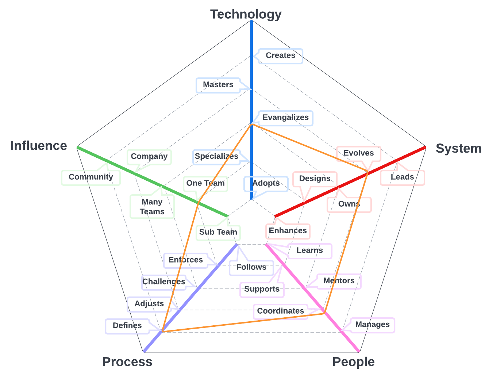
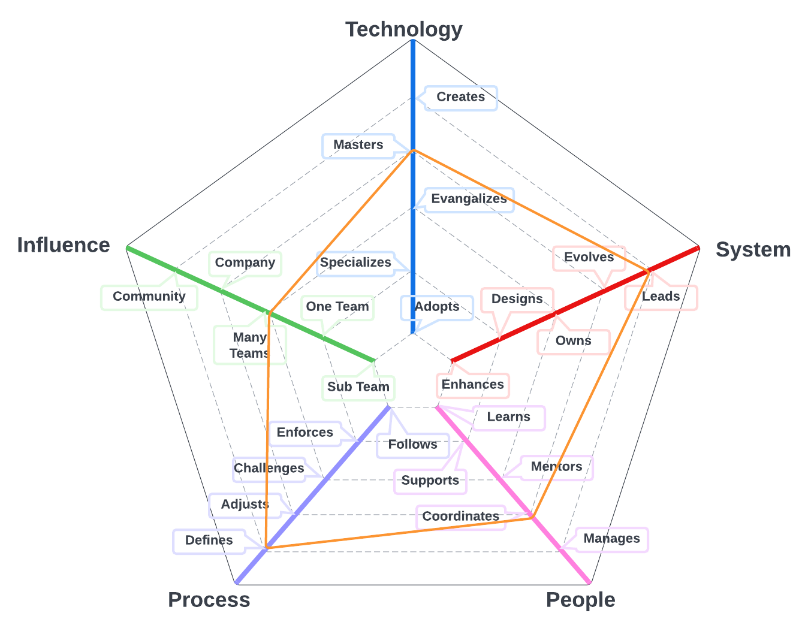
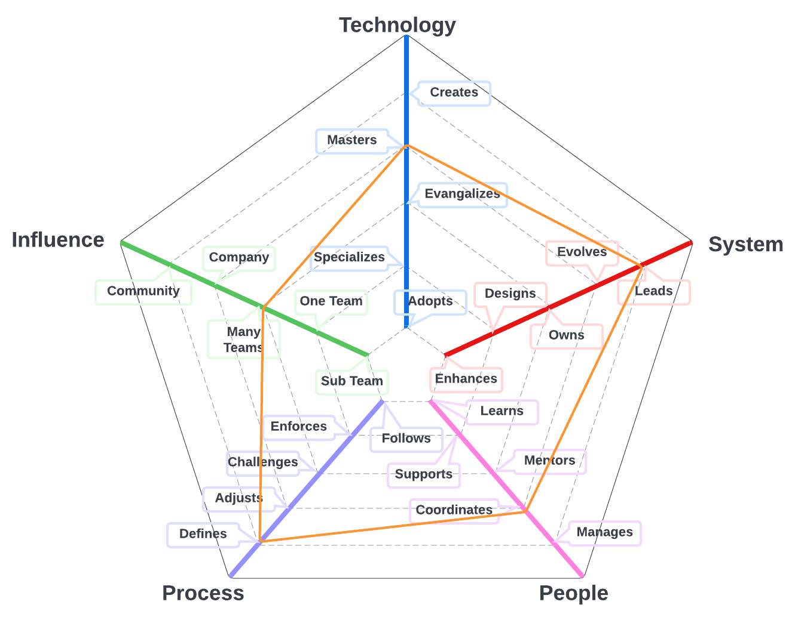

# Software Director

The primary system for team members on this path is software we build to enable our customers, all of the related technologies, and tools.

| Level | Position |
| :---: | :---: |
| 1 | [SD1 - Software Director 1](#sd1---software-director-1) |
| 2 | [SD2 - Software Director 2](#sd2---software-director-2) |
| 3 | [SD3 - Software Director 3](#sd3---software-director-3) |

# System Specifics:
* **Technology**: cloud infrastructure, application programming languages, infrastructure programming languages, etc   
* **System**: the running platform and everything that support it (e.g., build processes, deployment, monitoring, etc)
* **People**: relationship with the team(s)
* **Process**: level of engagement with software engineering processes
* **Influence**: social network influence

## SD1 - Software Director 1

* **[Technology](README.md#technology) - Evangelizes**
* **[System](README.md#technology) - Evolves**
* **[People](README.md#people) - Coordinates**
* **[Process](README.md#process) - Defines**
* **[Influence](README.md#influence) - Team**

## SD2 - Software Director 2

* **[Technology](README.md#technology) - Masters**
* **[System](README.md#technology) - Leads**
* **[People](README.md#people) - Coordinates**
* **[Process](README.md#process) - Defines**
* **[Influence](README.md#influence) - Multiple Teams**

## SD3 - Software Director 3

* **[Technology](README.md#technology) - Masters**
* **[System](README.md#technology) - Leads**
* **[People](README.md#people) - Coordinates**
* **[Process](README.md#process) - Defines**
* **[Influence](README.md#influence) - Company**

# Also Known As
* Technical Lead
* Tech Lead
* Development Lead
* Architect

# Other Pages
* [**Introduction**](README.md)
* [**Software Engineer**](Software-Engineer.md)
* [**Software Director**](Software-Director.md) 
* [**Quality Engineer**](Quality-Engineer.md)
* [**Quality Director**](Quality-Director.md)
* [**Delivery Engineer**](Delivery-Engineer.md)
* [**Delivery Director**](Delivery-Director.md)
* [**Product Engineer**](Product-Engineer.md)
* [**Product Director**](Product-Director.md)
* [**Engineering Director**](Engineering-Director.md)
* [**Software Director vs Engineering Support**](Comparison-Software-Director-Engineering-Director.md)
* [**Directing Directors**](Directing-Directors.md)