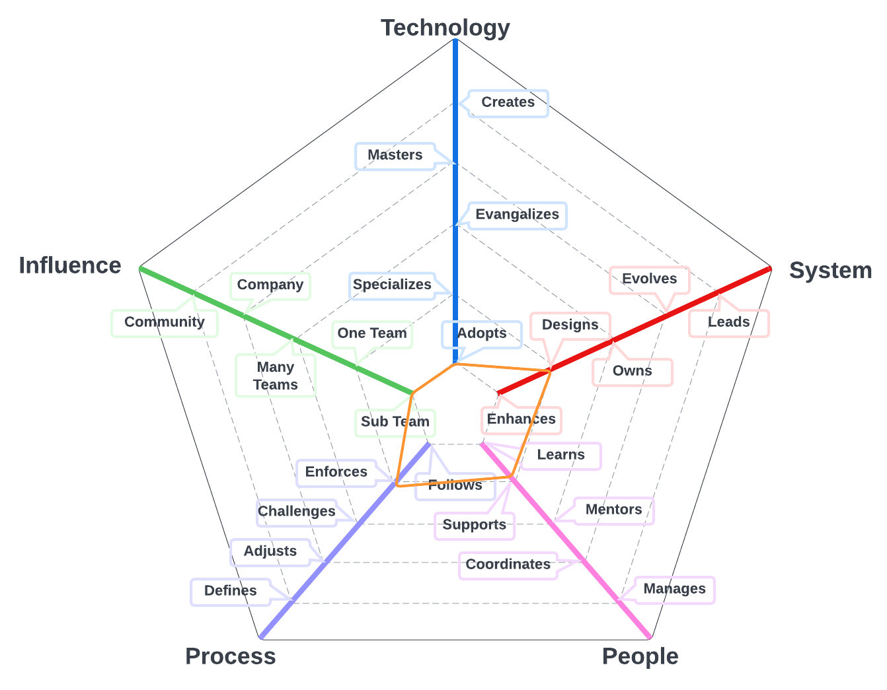
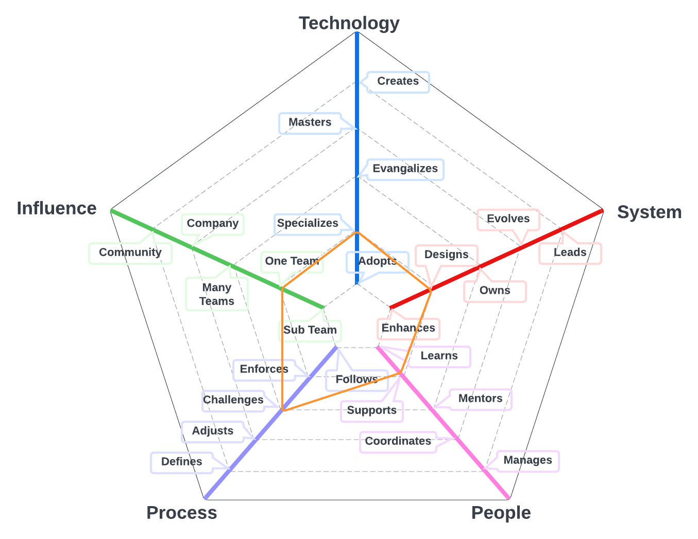
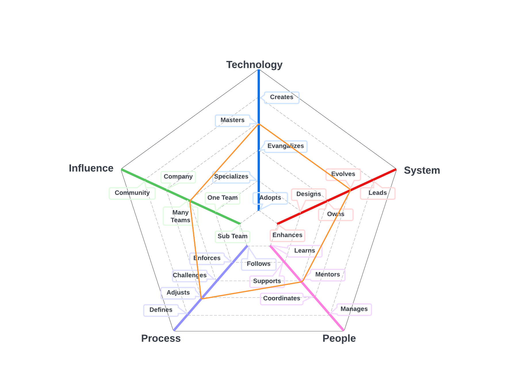
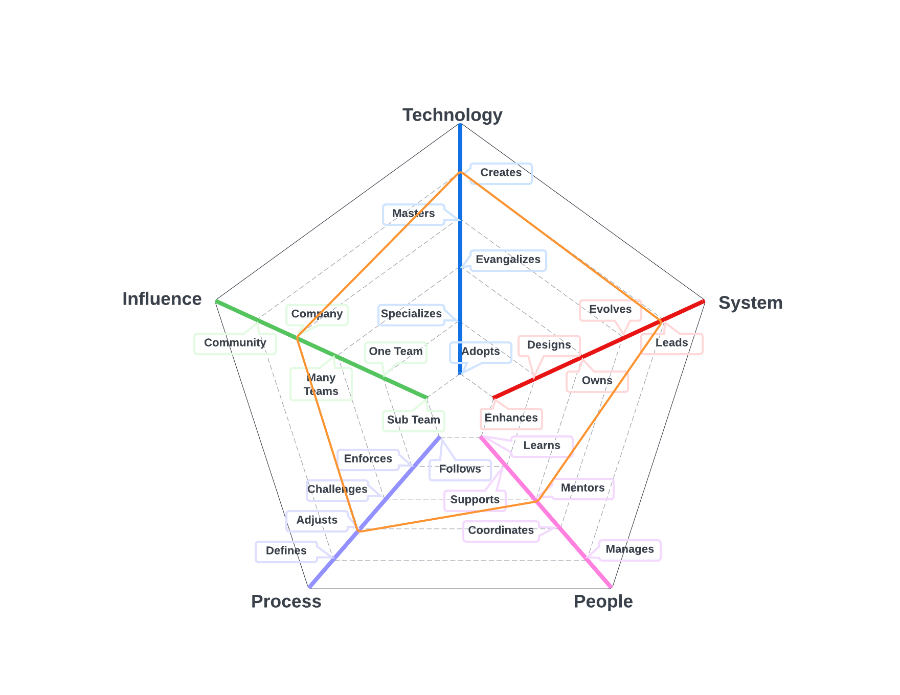
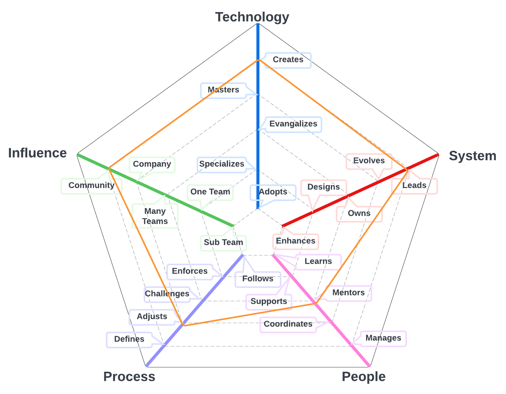

# Software Engineer

The primary system for team members on this path is software we build to enable our customers, all of the related technologies, and tools.

| Level | Position |
| :---: | :---: |
| 1 | [SE - Software Engineer 1](#se1---software-engineer-1) |
| 2 | [SE - Software Engineer 2](#se2---software-engineer-2) |
| 3 | [SE - Software Engineer 3](#se3---software-engineer-3) |
| 4 | [SE - Software Engineer 4](#se4---software-engineer-4) |
| 5 | [SE - Software Engineer 5](#se5---software-engineer-5) |
| 6 | [SE - Software Engineer 6](#se6---software-engineer-6) |
| 7 | [SE - Software Engineer 7](#se7---software-engineer-7) |

# System Specifics:
* **Technology**: cloud infrastructure, application programming languages, infrastructure programming languages, etc   
* **System**: the running platform and everything that support it (e.g., build processes, deployment, monitoring, etc)
* **People**: relationship with the team(s)
* **Process**: level of engagement with software engineering processes
* **Influence**: social network influence

## SE1 - Software Engineer 1

* **Adopts**: actively learns and adopts the technology and tools defined by the team for the system
* **Enhances**: successfully pushes new features and bug fixes to improve and extend the system
* **Learns**: quickly learns from others and consistently steps up when it is required
* **Follows**: follows the team processes, delivering a consistent flow of features to production
* **Subsystem**: makes an impact on one or more subsystems or team pods

## SE2 - Software Engineer 2

* **Adopts**: actively learns and adopts the technology and tools defined by the team for the system
* **Designs**: designs and implements medium to large size features while reducing the system's tech debt
* **Supports**: proactively supports other team members and helps them to be successful
* **Enforces**: enforces the team processes, making sure everybody understands the benefits and trade-offs
* **Subsystem**: makes an impact on one or more subsystems or team pods

## SE3 - Software Engineer 3

* **Specializes**: is the go-to person for one or more technologies and takes initiative to learn new ones
* **Designs**: designs and implements medium to large size features while reducing the system's tech debt
* **Supports**: proactively supports other team members and helps them to be successful
* **Challenges**: challenges the team processes, looking for ways to improve them
* **Team**: makes an impact on the whole team, not just on specific parts of it

## SE4 - Software Engineer 4

* **Evangelizes**: researches, creates proofs of concept and introduces new technologies to the team
* **Owns**: owns the production operation and monitoring of the system and is aware of its SLAs
* **Mentors**: mentors others to accelerate their career-growth and encourages them to participate
* **Challenges**: challenges the team processes, looking for ways to improve them
* **Team**: makes an impact on the whole team, not just on specific parts of it

## SE5 - Software Engineer 5

* **Masters**: has very deep knowledge about the whole technology stack of the system
* **Evolves**: evolves the architecture to support future requirements and defines its SLAs
* **Mentors**: mentors others to accelerate their career-growth and encourages them to participate
* **Adjusts**: adjusts the team processes, listening to feedback and guiding the team through the changes
* **Multiple Teams**: makes an impact not only on the whole team but also on other teams

## SE6 - Software Engineer 6

* **Creates**: designs and creates new technologies that are widely used either by internal or external teams
* **Leads**: leads the technical excellence of the system and creates plans to mitigate outages
* **Mentors**: mentors others to accelerate their career-growth and encourages them to participate
* **Adjusts**: adjusts the team processes, listening to feedback and guiding the team through the changes
* **Company**: makes an impact on the whole tech organization

## SE7 - Software Engineer 7

* **Creates**: designs and creates new technologies that are widely used either by internal or external teams
* **Leads**: leads the technical excellence of the system and creates plans to mitigate outages
* **Mentors**: mentors others to accelerate their career-growth and encourages them to participate
* **Adjusts**: adjusts the team processes, listening to feedback and guiding the team through the changes
* **Community**: makes an impact on the tech community

# Also Known As
* Software Developer
* Developer

# Other Pages
* [**Introduction**](README.md)
* [**Software Engineer**](Software-Engineer.md)
* [**Software Director**](Software-Director.md) 
* [**Quality Engineer**](Quality-Engineer.md)
* [**Quality Director**](Quality-Director.md)
* [**Delivery Engineer**](Delivery-Engineer.md)
* [**Delivery Director**](Delivery-Director.md)
* [**Engineering Director**](Engineering-Director.md)
* [**Software Director vs Engineering Support**](Comparison-Software-Director-Engineering-Director.md)
* [**Directing Directors**](Directing-Directors.md)
